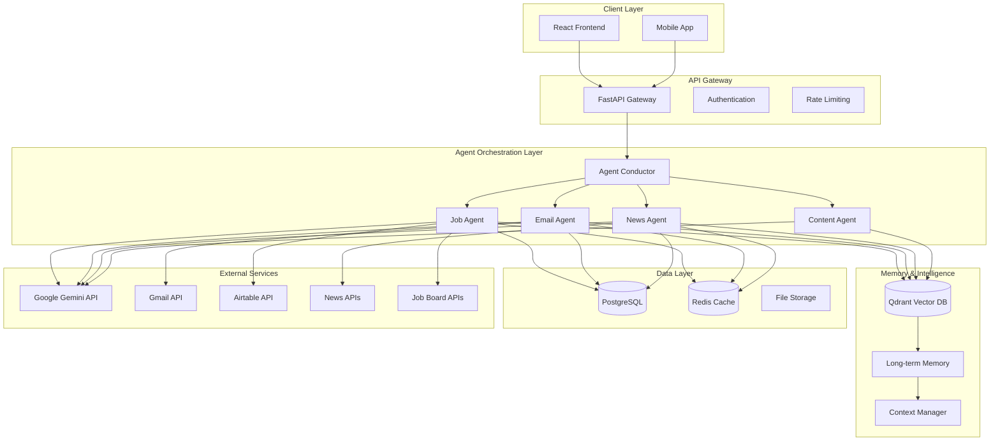

# System Architecture Specification

## Overview

The Smart Assistant employs a **microservices architecture** with **event-driven communication** between specialized AI agents. This design ensures scalability, maintainability, and cost-effective operation while providing enterprise-grade reliability.

## Architectural Principles

### 1. Separation of Concerns
Each agent has a single, well-defined responsibility with clear boundaries and interfaces.

### 2. Asynchronous Processing
Non-blocking operations enable efficient resource utilization and responsive user experience.

### 3. Shared Intelligence
Centralized vector memory provides contextual awareness across all agents and workflows.

### 4. Cost-Conscious Design
API calls are batched, cached, and optimized to minimize operational expenses.

### 5. Human-in-the-Loop
All AI decisions include user review and approval mechanisms for quality control.

## High-Level Architecture

## Core Components

### 1. Agent Conductor
- **Responsibility**: Orchestrates multi-agent workflows, manages task distribution, and maintains workflow state.
- **Key Functions**: Task routing, agent lifecycle management, cross-agent communication, and error handling.
- **Technology**: CrewAI framework with custom orchestration logic.

### 2. Vector Memory System
- **Responsibility**: Provides contextual intelligence and long-term memory across all agents.
- **Key Functions**: Semantic search, user profile storage, document history, and embedding management.
- **Technology**: Qdrant vector database with a custom memory management layer.

### 3. API Gateway
- **Responsibility**: Provides centralized access control, request management, and security enforcement for all client-facing services.
- **Key Functions**: Authentication, rate limiting, request routing, and monitoring.
- **Technology**: FastAPI with custom middleware.

## Agent Functional Specifications

This section defines the purpose, inputs, outputs, and core processing logic for each specialized agent.

### 1. Job Discovery Agent
- **Purpose**: To automate the identification, processing, and relevance scoring of new job opportunities.
- **Inputs**: User career profile, job board data (APIs/RSS), and historical application data.
- **Outputs**: Standardized job listings with relevance scores, matching rationale, and status updates.
- **Processing Steps**:
    1. Polls multiple job sources based on the user's profile.
    2. Deduplicates and standardizes incoming job data.
    3. Scores each job against the user's profile using the vector memory system.
    4. Stores qualified jobs in the database and triggers notifications for high-relevance matches.

### 2. Email Intelligence Agent
- **Purpose**: To intelligently process, categorize, and summarize incoming emails.
- **Inputs**: Gmail API data stream, user interaction patterns, and historical email classifications.
- **Outputs**: Categorized email summaries, action recommendations, and draft responses.
- **Processing Steps**:
    1. Fetches new emails via the Gmail API.
    2. Classifies each email by importance and category (e.g., Career, Financial, Personal).
    3. Extracts key information, entities, and context.
    4. Generates a concise summary and recommended actions, updating the user's daily briefing.

### 3. Content Generation Agent
- **Purpose**: To provide AI-assisted content creation for professional documents.
- **Inputs**: Base templates (CV, cover letters), target job descriptions, and user style preferences.
- **Outputs**: Tailored documents with change tracking, quality assessments, and version history.
- **Processing Steps**:
    1. Analyzes the target document's requirements (e.g., a job description).
    2. Retrieves relevant user experiences and skills from the vector memory system.
    3. Generates tailored content that aligns the user's profile with the target requirements.
    4. Creates a change log and presents the document for user review and approval.

### 4. News Curation Agent
- **Purpose**: To discover, synthesize, and deliver personalized information and news.
- **Inputs**: RSS feeds, news APIs, user interest profiles, and professional goals.
- **Outputs**: A daily intelligence briefing with synthesized insights and trend analysis.
- **Processing Steps**:
    1. Aggregates news and articles from multiple pre-approved sources.
    2. Filters content based on user interests and professional context.
    3. Generates concise summaries and identifies key insights or connections between articles.
    4. Formats the content into a structured daily briefing for the user.

## Data Flow & Communication Patterns

### 1. Event-Driven Communication
The system will use an event-driven model to ensure loose coupling and scalability between agents and services. An event bus will route events (e.g., `NEW_JOB_FOUND`, `EMAIL_PROCESSED`) to the appropriate handlers for asynchronous processing.

### 2. Batch Processing
To optimize cost and performance, interactions with external APIs (e.g., Gemini, Gmail) will be batched wherever feasible. A batch processing manager will be responsible for grouping items, executing requests, and handling partial failures gracefully.

### 3. Contextual Data Sharing
A centralized `ContextManager` will be responsible for retrieving and assembling user-specific context from the vector database and PostgreSQL. This ensures that every agent has access to the necessary information to perform its tasks effectively, promoting shared intelligence.

## Scalability & Performance

- **Horizontal Scaling**: The agent and API services will be stateless, allowing for horizontal scaling via multiple container instances managed by an orchestrator like Kubernetes.
- **Database Scaling**: The PostgreSQL database will be configured with read replicas to handle high query loads, separating transactional and analytical workloads.
- **Asynchronous Task Queues**: Heavy or long-running background tasks (e.g., document embedding, report generation) will be managed through a distributed task queue (e.g., Celery with Redis) to avoid blocking the main application threads.

## Error Handling & System Resilience

- **Circuit Breaker Pattern**: All external API calls will be wrapped in a circuit breaker pattern. If an external service becomes unresponsive or returns a high rate of errors, the circuit will open, preventing further calls and allowing the system to degrade gracefully (e.g., by serving cached data).
- **Idempotency**: Key API endpoints, particularly those creating or updating data, will be designed to be idempotent to prevent duplicate records or actions in the event of network retries.
- **Automated Retries**: A policy of exponential backoff will be applied to transient failures when communicating with external services.

## Security & Compliance

- **Authentication & Authorization**: User access will be controlled via JWT tokens, with role-based access control (RBAC) enforced at the API Gateway.
- **Data Encryption**: All sensitive user data will be encrypted both in transit (TLS 1.3) and at rest (AES-256).
- **Compliance**: The system will adhere to GDPR principles for data minimization, user consent, and the right to be forgotten. All PII data handling will be strictly controlled and logged.

## Monitoring & Observability

- **Structured Logging**: All services will generate structured logs (e.g., JSON format) with correlation IDs to trace requests across the entire system.
- **Metrics & Alerting**: Key performance indicators (KPIs)—such as API latency, error rates, and agent processing times—will be collected via Prometheus and visualized in Grafana. Automated alerts will be configured for critical events.
- **Health Checks**: Each service will expose a `/health` endpoint for automated health monitoring by the container orchestrator.

## Deployment

- **Containerization**: All services will be packaged as Docker containers.
- **Infrastructure as Code (IaC)**: The entire production environment will be defined using Terraform to ensure repeatable and version-controlled infrastructure.
- **CI/CD**: A continuous integration and deployment pipeline will be established (using GitHub Actions) to automate testing, security scans, and deployments to staging and production environments.

---

**Next**: Review [Agent Framework](./02-agent-framework.md) for detailed multi-agent patterns and workflows.
